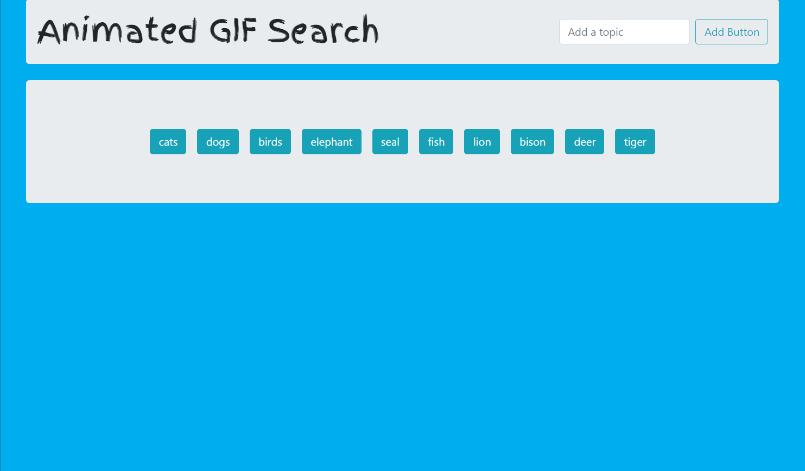
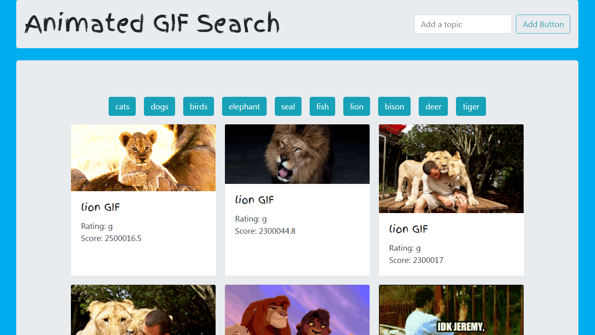

# GIF Search using Giphy API

[Link to GIF Search](https://chad-balash.github.io/trivia-game/)

This is an animated GIF search that returns 10 images based on the search criteria. I created this using html, css, javascript, jquery, ajax, bootstrap, and giphy api.

## Instructions

The page loads with buttons populated with topics. Click a button to display 10 GIFs for that particular topic. Click the image to play or stop the animation. 

To add a button for GIF search, enter a topic in the text field then click the **Add Button** button.

## Screenshots

## Built With

* html, css, javascript, jquery, ajax, bootstrap, and giphy api

## Authors

* **Chad Balash** - [Profile](https://github.com/chad-balash)

## Acknowledgments

*[hongkiat.com](https://www.hongkiat.com) for Run Animated GIF On-click 
